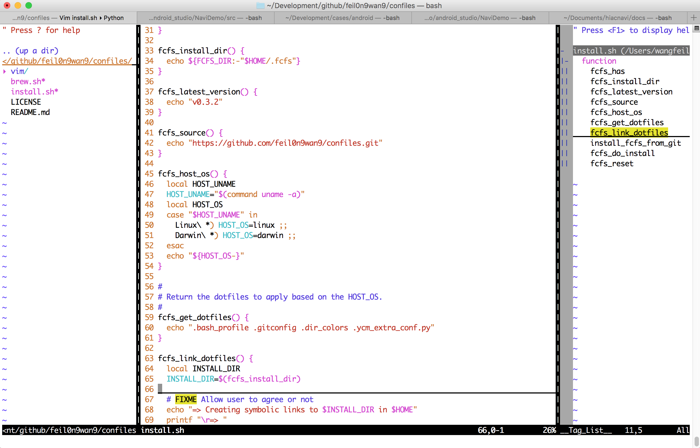

# Vim Configuration File

The file contains vim configuration, vim plugin management and vim plugin configuration, and you can setup this alone without the need to clone this entire repository.


## Installation

NOTE: As we have added [Valloric/YouCompleteMe](https://github.com/Valloric/YouCompleteMe) plugin, you may need do a little more operations to let it work after all plugins installed. Please reference to [this](https://github.com/Valloric/YouCompleteMe#c-family-semantic-completion) for detail, and don't worry, it is quite simple.

1. Set up `~/.vimrc`. To try this configuration file, you can download the `.vimrc` directly to avoid cloning this repository.
    ```bash
    curl -o ~/.vimrc https://raw.githubusercontent.com/feil0n9wan9/confiles/master/vim/.vimrc
    ```

2. Set up [Vundle](https://github.com/VundleVim/Vundle.vim):
    ```bash
    git clone https://github.com/VundleVim/Vundle.vim.git ~/.vim/bundle/Vundle.vim
    ```

3. Install plugins:
    ```bash
    vim +PluginInstall +qall
    ```

4. Enjoy it:)


## Screenshot

